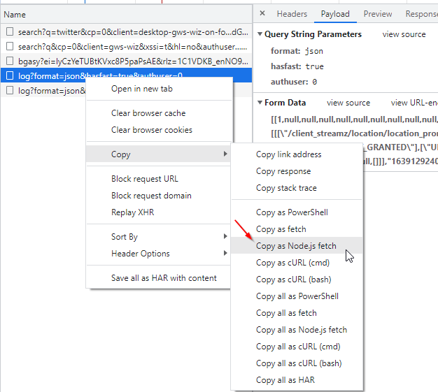

# nodeAsScriptTool
Demo code showing off some simple tasks that can be done with node

## Prerequisites
* [Node](https://nodejs.org/en/) 
* [git](https://gitforwindows.org/)

## To use 
* git clone 
* npm install
* modify config.json to include correct servername, port and username password 

## Usefull links 
* [VSCode] (https://code.visualstudio.com/)
* [MYySQL for node](https://github.com/sidorares/node-mysql2)
* [Node fs (filesystem)](https://nodejs.org/api/fs.html)
* [XLSX] (https://www.npmjs.com/package/xlsx)
* [MSSQL] (https://www.npmjs.com/package/mssql)
* [msnodesqlv8 official TDS driver] (https://www.npmjs.com/package/msnodesqlv8)
* [Node fetch] (https://www.npmjs.com/package/node-fetch)
* [Disable SSL verification] (https://stackoverflow.com/questions/52478069/node-fetch-disable-ssl-verification)

## Node fetch
You can easily copy an API request from the chrome developer console into the fetch.js script by simply going 